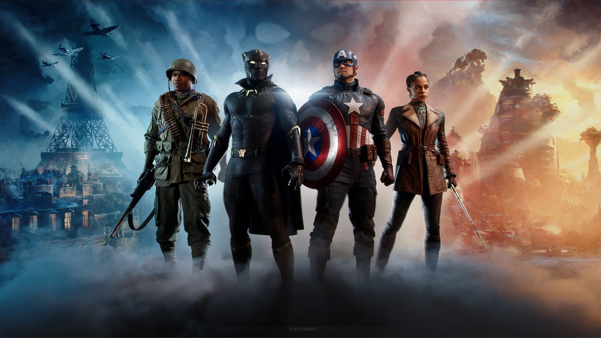

# 🔫Casino Ethereum platform – A cutting-edge Ethereum GameFi platform powered by Scaffold-ETH, combining the excitement of casino gameplay with crypto rewards in a next-generation decentralized Marvel-themed experience.

> A multiplayer role-based blockchain game featuring assassins, police, and citizens.

🌐 Telegram: [@web3_maxim](https://t.me/web3_maxim)



---

## 🚀 Project Overview

This project demonstrates how a Marvel-inspired role-based game can thrive in the **Web3 space**. Built with the **Scaffold ETH** stack using **Next.js**, **Hardhat**, and **RainbowKit**, the game incorporates both **on-chain logic** and fast off-chain mechanics.

Players join using their crypto wallets and are secretly assigned one of the following roles:
- 🗡️ Assassin
- 👮 Police Officer
- 🧑 Citizen

---

## 🎯 Definition of Done

✅ Built with:  
- **Next.js**  
- **RainbowKit**  
- **Hardhat**  
- **Wagmi**  
- **Viem**  
- **TypeScript**

🎮 Gameplay:
- 4 total players: 1 human player and 3 NPCs
- Secret roles (randomized at start)
- Team-based logic:
  - Assassins vs. Town (Police & Citizens)
- Night/Day cycles
- Community voting
- Secret actions and outcomes

---

## 🖼️ Gameplay Preview


---

## 📦 Requirements

Ensure the following tools are installed:

- [Node.js (≥ v18.18)](https://nodejs.org/en/download/)
- [Yarn](https://classic.yarnpkg.com/en/docs/install/)
- [Git](https://git-scm.com/downloads)

---

## ⚙️ Game Setup

```bash
git clone https://github.com/osmanx8/marvel.git
cd marvel
yarn install
